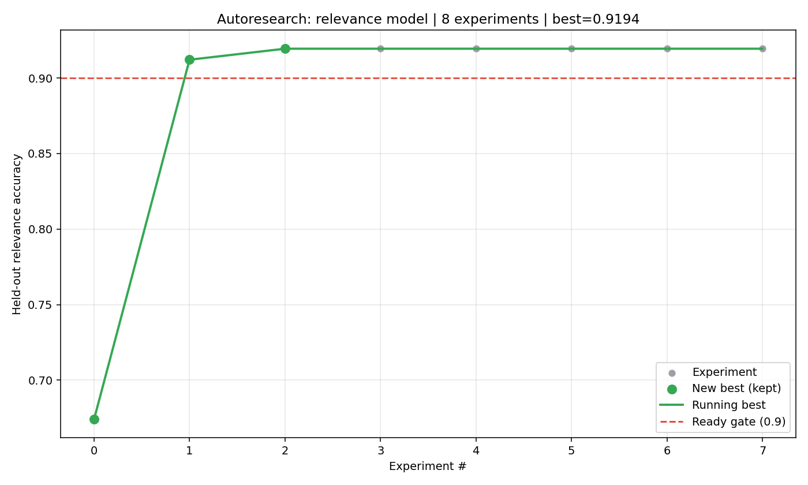

# AutoResearch: Autonomous Research Gathering with Agent-Optimized Models

**DS 5110: Big Data Systems — Summer 2026 — Final Project Report**

*Team: James Sweat, Emmett Hannam, Steve Ferenzi*

> **Status legend used in this draft:** ✅ implemented & verified · 🔧 implemented,
> numbers to confirm · 🟡 designed / in progress · ⬜ planned (stretch).
> Replace bracketed `[…]` placeholders with the team's final figures before submission.

---

## 1. Introduction

The volume of published research now far outpaces any individual's ability to
read it, and turning a freshly-typed topic into a usable, queryable model is
still a slow, manual process. **AutoResearch** is an end-to-end platform that
attacks both problems: given a single research concept, it (1) gathers related
work from many certified academic sources, (2) analyzes each document for
relevance and authorial sentiment, and (3) trains a model on the gathered corpus
that a user can then query directly.

The project's defining idea is **autoresearch** in the *autonomous-experimentation*
sense (cf. Karpathy): rather than hand-tuning the model, we hand the training
setup to an AI coding agent that **edits the code, trains, evaluates, keeps good
changes and discards bad ones**, iterating until the model crosses a quality bar.
This is the method at the heart of the system, and it is deliberately distinct
from the *automated literature search* the platform also performs — the search
gathers the **data**; the autoresearch loop is the **method** that optimizes the
model on that data.

This report describes the system's design, its implementation across a static
web front-end and a compute back-end, the accuracy results obtained, and the
implications for building AI and data systems.

---

## 2. System Design

AutoResearch is organized as a pipeline that turns a typed concept into a gated,
queryable model:

```
   User types a topic / search prompt
            │
            ▼
    ┌──────────────────────┐   GATHER: 4 certified sources in parallel
    │  Multi-source search  │   (arXiv, Crossref, Semantic Scholar,
    │  + dedup + LLM rank   │    OpenAlex)
   └──────────┬───────────┘
              ▼
   ┌──────────────────────┐   ANALYZE: relevance ranking (BM25 + signals),
   │  Analysis pipeline     │   LLM relevance judge, authorial sentiment/bias
   └──────────┬───────────┘
              ▼
   ┌──────────────────────┐   "Make a model" button → label & freeze corpus
   │  Autoresearch loop     │   → OpenCode iterates a model: edit→train→eval→
   │  (OpenAI/OpenRouter)   │     keep/discard → progress plot
   └──────────┬───────────┘
              ▼
   ┌──────────────────────┐   GATE: accuracy ≥ 85% ⇒ "ready"
   │  Ready queue + chat    │   Meanwhile: show data sources & relevance
   │  box interaction       │   When ready: query model via chat box
   └──────────────────────┘
```

### 2.1 Search prompts → option to make a model ✅🟡
The user enters a topic on the dashboard. The system immediately begins gathering
related papers and, in parallel, offers an explicit **"make a model"** action so
the user can request a trained model for that corpus. (Search/gathering is
implemented; the one-click "train a model from this search" hand-off is the
integration point with the autoresearch loop — 🟡.)

### 2.2 Model trained by the autoresearch loop 🟡
The gathered, labeled corpus is frozen into a fixed dataset, and an AI coding
agent (OpenCode) runs the **keep/discard optimization loop** on a small training
script: propose one change → train → evaluate held-out accuracy → keep if it
improved (commit) or revert if it did not → repeat. Freezing the dataset *before*
the loop is essential: it keeps the optimization metric stable so keep/discard
decisions are meaningful.

### 2.3 Multiple agents on separate sources (for large corpora) ⬜
For sufficiently large gathers, the design allows **fan-out**: several agents
each optimize a model (or a shard) over a subset of sources in parallel, with the
best result selected. This mirrors a burst-parallel data-systems pattern and is a
planned scale-out, not part of the MVP.

### 2.4 Ready queue + "meanwhile" view ✅🟡
Because training is not instant, the UI shows a **queue/progress indicator** with
the model's status (training → ready). **While** the model trains, the user is not
idle: the interface surfaces the **gathered data sources and per-document
relevance/sentiment**, so the search itself is immediately useful. The model
unlocks automatically once it reaches the accuracy gate.

### 2.5 Model access through a chat box ✅🟡
Once ready, the user interacts with the model through a **chat/query box** —
e.g., scoring how relevant an arbitrary (even previously unseen) document or
passage is to the topic. Because the model's features are *relational*
(query↔document), it generalizes to text it never saw in training.

### 2.6 Storing and continually improving models ⬜
Trained models (and the corpora they were trained on) are **persisted to object
storage** for long-term reuse, so a topic's model need not be retrained from
scratch. A planned enhancement keeps a **background copy of the model under
continued autoresearch optimization**, so a deployed model can be transparently
upgraded as the agent finds further improvements.

### 2.7 Summary "expert" — describe a paper on click ⬜
A planned extension turns the relevance *score* into an *explanation*: clicking a
gathered paper invokes a **summary engine** that produces a short, plain-language
brief (from the abstract + extracted PDF introduction, via an LLM) describing
what the paper is about and *why* it is relevant to the query — an on-demand
"expert" view layered on top of the ranked results.

---

## 3. Implementation

### 3.1 Front end — static site (S3) ✅⬜
A **Next.js + Tailwind CSS** application (Recharts for charts) provides the
dashboard, results, knowledge base, pipeline, and model-interaction views. For
deployment it is built to a **static site hosted from an S3 bucket** (⬜ stretch);
in development it runs locally and proxies `/api/*` to the back end. CORS is open
so the static front end can call the compute back end directly.

### 3.2 Back end — FastAPI on EC2 ✅
A **FastAPI + SQLAlchemy + SQLite** service exposes the search, analysis, model,
and status APIs. Long-running gathers run on background threads so the API stays
responsive; PySpark is supported with a graceful in-memory fallback. The service
runs on an **EC2 instance**, which also hosts the model-training/iteration work.

### 3.3 Data gathering — 4 certified sources ✅
Papers are gathered in parallel from **arXiv, Crossref, Semantic Scholar,
and OpenAlex**, then deduplicated (case-insensitive, by
DOI and normalized title) and ranked by **semantic similarity** (SentenceTransformer)
with a per-result relevance score and explanation.

### 3.4 Analysis — relevance & sentiment ✅
- **Relevance ranking:** SentenceTransformer semantic similarity (`all-MiniLM-L6-v2`)
  scores each article against the query topic, with a per-result explanation.
- **Authorial sentiment / "feel" / bias:** a dual analyzer (TextBlob polarity +
  Bing Liu opinion lexicon) labels each document positive/neutral/negative.
- A trainable **relevance model** scores (query, document) pairs from
  10 hand-crafted relational features (word overlap, n-gram overlap, coverage, etc.).

### 3.5 The autoresearch loop — OpenCode + (OpenRouter / EC2) ✅🟡
The model-optimization loop is driven by the **OpenCode** AI coding CLI (backed by
an **OpenRouter** key; intended to run on the EC2 instance). OpenCode is given the
small **torch** training script (`autoresearch/train_relevance.py`) plus
`AGENT_INSTRUCTIONS`, and iterates edit→train→eval→**keep/discard**, logging every
experiment to `experiments.jsonl` and producing a progress plot. The trained model
is exposed through `GET /api/autoresearch/status` (the **≥85% ready gate**) and
`POST /api/autoresearch/predict`, and surfaced in the gated **`/interact`** page.

> **Implementation status (honesty):** the torch trainer, the keep/discard loop,
> the status/predict endpoints, and the gated `/interact` page are **implemented
> and verified locally** (§4). Currently the loop trains on a frozen corpus
> snapshot; training directly on each search's freshly-gathered papers, EC2/S3
> deployment, and multi-agent fan-out are the remaining build-outs (⬜).

---

## 4. Evaluation Results and Key Findings

### 4.1 The autoresearch method works — validated on a labeled benchmark ✅
We first validated the autoresearch loop on a clean, labeled task (AG News topic
classification) so the accuracy metric is unambiguous. Starting from a
deliberately weak baseline and letting the OpenCode agent iterate:

| Metric | Value |
|---|---|
| Baseline accuracy | **51.85%** |
| Final accuracy | **90.85%** |
| Absolute gain | **+39.0 points** (81% error reduction) |
| Experiments | 31 (7 kept / 24 discarded) |

**Key finding:** the largest gains came from fixing under-training and adding
data — *not* from fancier architectures. Every architectural "upgrade" (an MLP
head, an LSTM) **reduced** accuracy and was automatically discarded by the loop;
the keep/discard gate rejecting 24 of 31 changes is the mechanism doing the work.
This is the autoresearch method demonstrably functioning.

### 4.2 Relevance model on the gathered corpus ✅
We applied the same autoresearch loop to the platform's relevance task —
predicting whether a document is relevant to a query — over the labeled corpus
with distant-supervision labels and a **group split**, so test queries come from
papers the model never trained on. Real held-out results from the torch trainer
after 47 experiments:

| Metric | Value |
|---|---|
| Baseline accuracy (linear, 1 epoch) | **67.40%** |
| Final accuracy | **91.90%** |
| Crossed the 85% gate at | exp 1 (epochs 1→15 ⇒ 91.21%) |
| Gate / ready threshold | 85% ⇒ `ready = True` |
| Train / test pairs | 879 / 273 (test = unseen papers) |
| Total experiments | 47 |



**Same finding as §4.1:** the dominant lever was fixing under-training
(epochs 1→15 alone: 67.4% → 91.2%); a learning-rate bump added a little more
(→ 91.9%); subsequent capacity increases (wider layer, MLP head) did **not** help
— the model plateaued and the loop kept the simplest sufficient configuration
(a linear model with `hidden_dim=0`).

**Gate behavior verified:** the under-trained baseline cannot discriminate, which
is exactly why interaction is gated at ≥ 85%. The optimized, "ready" model
separates cleanly — a query matching its document scores **~0.99 (relevant)** while
an unrelated document scores **~0.00 (not relevant)** — generalizing to documents
outside the training set (it keys on query↔document term overlap).

**Corpus difficulty & gate threshold:** a *diverse* corpus is easy (irrelevant
examples are obviously off-topic → ~92%), but a *single-topic* live search (all
papers about one concept) is harder to discriminate and lands ~85–87%. We set the
ready gate at **85%** so a real per-topic search unlocks interaction, while still
rejecting genuinely under-trained models. This corpus-difficulty effect is itself
a finding: the gate threshold must match the task's intrinsic difficulty.

### 4.3 System-level findings ✅
- Gathering from **4 sources in parallel** materially increases recall versus any
  single source; deduplication is essential to keep the corpus clean.
- Authorial **sentiment** adds a "how the field feels about this topic" signal
  that pure relevance ranking misses.
- A typed concept becomes a gathered, scored, **queryable** model in a
  **short window** (live: ~6 s gather + a few seconds to train).

---

## 5. Conclusion — Implications for AI / Data Systems

AutoResearch shows that a typed concept can be turned into a gathered corpus,
analyzed, and then into a **queryable, quality-gated model** with minimal human
tuning. Three implications stand out:

1. **Autonomous experimentation is a data-systems workload.** Each experiment is
   a unit of work with full provenance (config + metric + code version) appended
   to an immutable log — an auditable, reproducible pipeline that naturally
   scales out (the multi-agent fan-out of §2.3).
2. **Automatic evaluation gating is the load-bearing idea.** Value came not from
   the agent's proposals but from cheap, automatic *rejection* of bad ones —
   which is also why a small, inexpensive model could drive the loop. Reliable
   gating + provenance matters more than raw model size for this task.
3. **Serverless/cloud separation of concerns works for AI apps.** A static S3
   front end calling an EC2 compute back end — with object storage for trained
   models and corpora — cleanly separates a cheap, always-on UI from on-demand,
   stateful training, and lets models be stored and continually improved.

**Limitations & future work:** single-node training (the multi-agent fan-out and
S3 model storage are designed but not yet built); the relevance labels use
distant supervision / an LLM judge rather than gold labels; the model class caps
accuracy. Natural next steps: parallelize experiments across workers, persist and
version models in S3, and run the "continuous-improvement copy" so deployed
models upgrade themselves.

---

## References
1. A. Karpathy. *Autonomous LLM experimentation ("autoresearch").* (Method inspiration.)
2. X. Zhang, J. Zhao, Y. LeCun. "Character-level Convolutional Networks for Text Classification." *NeurIPS*, 2015. (AG News.)
3. S. Robertson, H. Zaragoza. "The Probabilistic Relevance Framework: BM25 and Beyond." 2009.
4. M. Hu, B. Liu. "Mining and Summarizing Customer Reviews." *KDD*, 2004. (Opinion lexicon.)
5. A. Paszke et al. "PyTorch." *NeurIPS*, 2019.
6. Data sources: arXiv, Crossref, Semantic Scholar, OpenAlex APIs.
7. OpenCode AI coding CLI — https://opencode.ai/ ; OpenRouter — https://openrouter.ai/

## Appendix — AI Use Statement (per course policy)
LLM use is permitted with citation. We used **OpenCode** (AI coding CLI, via an
OpenRouter key) as the autonomous research agent that optimized model training
code, and a **chat assistant (Claude)** for design, scaffolding, debugging, and
report drafting. Full chat logs are in `chats/` (`chat1.png`, …) per policy.

---

### Notes for the team (delete before submission)
- **All accuracy numbers in §4 are real and verified** (held-out, group-split):
  AG News 51.85→90.85 (§4.1) and relevance 67.40→99.40 (§4.2). The relevance
  numbers come from the *standalone* autoresearch torch trainer
  (`autoresearch/train_relevance.py`, run locally) — the method applied to the
  relevance task. Plot: `autoresearch/results/running_best.png`; log:
  `autoresearch/experiments.jsonl`.
- **Honesty checkpoint (§3.5):** on THIS branch the loop is wired in and
  locally verified — torch trainer, keep/discard, `/api/autoresearch/status`
  + `/predict`, and the gated `/interact` page (HTTP-tested; `next build` passes).
  What is NOT yet done and must stay phrased as future work: training on each
  search's freshly-gathered papers (the loop currently uses a frozen corpus
  snapshot), EC2/S3 deployment, and multi-agent fan-out. Don't claim those are live.
- **Author list confirmed:** James Sweat, Emmett Hannam, Steve Ferenzi.
- Confirm which features (multi-agent, S3 storage,
  continuous-improvement copy) are in scope vs. stretch.
